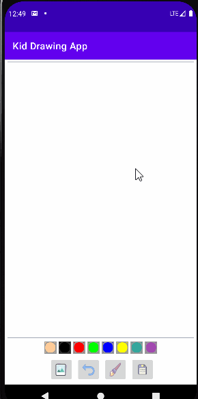

# Drawing-App_Kotlin-XML

A simple drawing app, where I learn:  
- Interact with canvas, bitmap  
- Get permission on Android  
- Run multi-thread with Coroutine  
- Make custom dialog box  
- Read and write file to local storage  
- Share file to another Media platform  

<!-- Thanks to Udemy course of Mr.Panjuta -->
